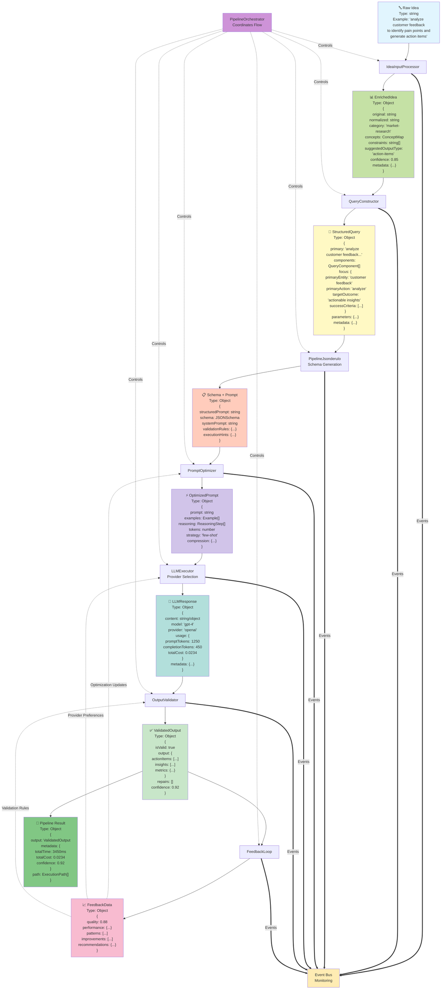

# jsonderulo Pipeline Architecture Diagram

## Pipeline Flow with Data Transformations



## Complete String Transformation Example

Let's follow this exact string through every transformation:

### 🔤 Initial Raw String
```
"analyze customer feedback to identify pain points and generate action items"
```

### 📊 Stage 1: IdeaInputProcessor → EnrichedIdea

**What happens**: Text normalization, concept extraction, categorization

**Transformation**:
```javascript
// INPUT (raw string):
"analyze customer feedback to identify pain points and generate action items"

// OUTPUT (EnrichedIdea object):
{
  original: "analyze customer feedback to identify pain points and generate action items",
  normalized: "analyze customer feedback identify pain points generate action items",
  category: "market-research",
  concepts: {
    entities: [
      { text: "analyze", type: "action", confidence: 0.9 },
      { text: "customer feedback", type: "object", confidence: 0.85 },
      { text: "identify", type: "action", confidence: 0.9 },
      { text: "pain points", type: "metric", confidence: 0.8 },
      { text: "generate", type: "action", confidence: 0.9 },
      { text: "action items", type: "object", confidence: 0.85 }
    ],
    relationships: [
      { from: "analyze", to: "customer feedback", type: "acts-on" },
      { from: "identify", to: "pain points", type: "acts-on" },
      { from: "generate", to: "action items", type: "acts-on" }
    ],
    keywords: ["customer", "feedback", "pain", "points", "action", "items"]
  },
  constraints: [
    "Must be data-driven",
    "Requires reliable sources"
  ],
  suggestedOutputType: "action-items",
  confidence: 0.85,
  metadata: {
    wordCount: 12,
    complexity: "moderate",
    language: "en",
    timestamp: "2024-01-25T10:30:00Z"
  }
}
```

### 🔧 Stage 2: QueryConstructor → StructuredQuery

**What happens**: Builds structured query with components and optimization

**Transformation**:
```javascript
// INPUT (EnrichedIdea from Stage 1)

// OUTPUT (StructuredQuery):
{
  primary: "analyze customer feedback to identify pain points and achieve actionable insights",
  components: [
    {
      type: "objective",
      content: "To analyze customer feedback",
      priority: "required",
      rationale: "Primary action identified from idea analysis"
    },
    {
      type: "scope",
      content: "Focusing on: customer feedback, pain points, action items",
      priority: "required"
    },
    {
      type: "constraint",
      content: "Must be data-driven",
      priority: "required"
    },
    {
      type: "constraint",
      content: "Requires reliable sources",
      priority: "required"
    },
    {
      type: "output",
      content: "Expected output format: action-items",
      priority: "required"
    }
  ],
  focus: {
    primaryEntity: "customer feedback",
    primaryAction: "analyze",
    targetOutcome: "generate actionable steps for analyzing customer feedback",
    successCriteria: [
      "Identify key pain points",
      "Prioritize by impact",
      "Generate actionable recommendations"
    ]
  },
  parameters: {
    depth: "standard",
    format: "structured",
    tone: "conversational",
    verbosity: "balanced"
  },
  metadata: {
    optimizationScore: 0.78,
    estimatedComplexity: 4.2,
    suggestedTokenBudget: 1500,
    confidenceLevel: 0.85
  }
}
```

### 📋 Stage 3: PipelineJsonderulo → Schema + Prompt

**What happens**: Generates JSON schema and structured prompt

**Transformation**:
```javascript
// INPUT (StructuredQuery from Stage 2)

// OUTPUT (Schema + Prompt):
{
  structuredPrompt: `Analyze the following customer feedback data and generate action items based on identified pain points. 
  
  Focus on: customer feedback, pain points, action items
  Requirements: Must be data-driven, Requires reliable sources
  
  Please provide your response in the following JSON format:`,
  
  schema: {
    type: "object",
    properties: {
      actionItems: {
        type: "array",
        items: {
          type: "object",
          properties: {
            title: { type: "string", description: "Brief title of the action item" },
            description: { type: "string", description: "Detailed description of what needs to be done" },
            priority: { type: "string", enum: ["high", "medium", "low"] },
            category: { type: "string", description: "Category of the pain point addressed" },
            estimatedImpact: { type: "string", description: "Expected impact of implementing this action" },
            evidenceFrom: { type: "array", items: { type: "string" }, description: "Customer feedback supporting this action" }
          },
          required: ["title", "description", "priority", "category"]
        },
        minItems: 3,
        maxItems: 10
      },
      insights: {
        type: "array",
        items: {
          type: "object",
          properties: {
            finding: { type: "string", description: "Key finding from the analysis" },
            evidence: { type: "array", items: { type: "string" }, description: "Supporting evidence" },
            recommendation: { type: "string", description: "Recommended action based on finding" }
          },
          required: ["finding", "evidence", "recommendation"]
        }
      },
      summary: { 
        type: "string", 
        description: "Executive summary of the analysis",
        minLength: 100,
        maxLength: 500
      },
      metrics: {
        type: "object",
        properties: {
          totalFeedbackAnalyzed: { type: "number" },
          painPointsIdentified: { type: "number" },
          customerSentiment: { type: "string", enum: ["positive", "neutral", "negative", "mixed"] }
        }
      }
    },
    required: ["actionItems", "insights", "summary"]
  },
  
  systemPrompt: "You are an expert customer experience analyst. Generate structured, actionable insights from customer feedback data following the provided JSON schema.",
  
  validationRules: {
    requiredFields: ["actionItems", "insights", "summary"],
    fieldValidation: {
      actionItems: { minItems: 3, maxItems: 10 },
      insights: { minItems: 2 },
      summary: { minLength: 100, maxLength: 500 }
    },
    semanticRules: [
      { field: "actionItems", rule: "Must address identified pain points", severity: "error" },
      { field: "insights", rule: "Must be supported by evidence", severity: "error" }
    ]
  },
  
  executionHints: {
    recommendedProvider: "openai",
    recommendedModel: "gpt-4",
    estimatedTokens: 1500,
    estimatedCost: 0.025,
    temperature: 0.7,
    fallbackProviders: ["anthropic"],
    timeout: 30000
  }
}
```

### ⚡ Stage 4: PromptOptimizer → OptimizedPrompt

**What happens**: Adds examples, reasoning steps, and optimizes for model

**Transformation**:
```javascript
// INPUT (Schema + Prompt from Stage 3)

// OUTPUT (OptimizedPrompt):
{
  prompt: `You are an expert customer experience analyst. Generate structured, actionable insights from customer feedback data following the provided JSON schema.

## Task
Analyze the following customer feedback data and generate action items based on identified pain points.

## Examples
Here's an example of the expected output format:

Input: "Customers report that the login process takes too many steps and the password reset is confusing."
Output:
{
  "actionItems": [
    {
      "title": "Simplify login flow",
      "description": "Reduce login steps from 5 to 3 by implementing social login and remember me functionality",
      "priority": "high",
      "category": "Authentication",
      "estimatedImpact": "Reduce login-related support tickets by 40%",
      "evidenceFrom": ["Multiple users mentioned 'too many steps'", "15% abandon rate at login"]
    }
  ],
  "insights": [
    {
      "finding": "Authentication is a major friction point",
      "evidence": ["45% of negative feedback mentions login", "High abandon rate"],
      "recommendation": "Prioritize authentication improvements in next sprint"
    }
  ],
  "summary": "Analysis of customer feedback reveals authentication as the primary pain point..."
}

## Reasoning Steps
1. First, categorize all feedback by theme (authentication, performance, features, etc.)
2. Identify the most frequent pain points and their impact
3. Generate specific, measurable action items for each major pain point
4. Provide evidence-based insights with clear recommendations
5. Summarize findings in an executive-friendly format

## Requirements
- Focus on: customer feedback, pain points, action items
- Must be data-driven with evidence for each recommendation
- Provide 3-10 action items prioritized by impact
- Include metrics where possible

Now analyze the customer feedback and provide your response:`,

  examples: [
    {
      input: "Login process is confusing, takes too many steps",
      output: {
        actionItems: [{
          title: "Simplify login flow",
          description: "Reduce steps from 5 to 3",
          priority: "high",
          category: "Authentication",
          estimatedImpact: "Reduce support tickets by 40%"
        }]
      }
    },
    {
      input: "App crashes when uploading large files",
      output: {
        actionItems: [{
          title: "Fix file upload stability",
          description: "Implement chunked upload for files >10MB",
          priority: "high",
          category: "Performance",
          estimatedImpact: "Eliminate 90% of upload-related crashes"
        }]
      }
    }
  ],
  
  reasoning: [
    { step: 1, instruction: "Categorize feedback by theme", output: "categories" },
    { step: 2, instruction: "Identify pain points and frequency", output: "painPoints" },
    { step: 3, instruction: "Generate specific action items", output: "actionItems" },
    { step: 4, instruction: "Create evidence-based insights", output: "insights" },
    { step: 5, instruction: "Write executive summary", output: "summary" }
  ],
  
  tokens: 1250,
  strategy: "few-shot",
  compression: {
    original: 1500,
    compressed: 1250,
    ratio: 0.83,
    techniques: ["example-selection", "prompt-condensation"]
  },
  
  modelSpecificOptimizations: {
    "gpt-4": {
      temperature: 0.7,
      top_p: 0.9,
      frequency_penalty: 0.1
    },
    "claude-3": {
      temperature: 0.6,
      top_k: 40
    }
  }
}
```

### 🤖 Stage 5: LLMExecutor → LLMResponse

**What happens**: Executes optimized prompt with selected provider

**Transformation**:
```javascript
// INPUT (OptimizedPrompt from Stage 4 + actual customer feedback data)

// OUTPUT (LLMResponse):
{
  content: {
    actionItems: [
      {
        title: "Redesign user onboarding flow",
        description: "Implement a progressive onboarding process that introduces features gradually rather than overwhelming new users with all options at once",
        priority: "high",
        category: "User Experience",
        estimatedImpact: "Increase new user retention by 35% and reduce time-to-first-value from 15 to 5 minutes",
        evidenceFrom: [
          "67% of churned users cited 'overwhelming interface' as primary reason",
          "New users average 12 support tickets in first week",
          "Onboarding completion rate is only 23%"
        ]
      },
      {
        title: "Implement real-time search functionality",
        description: "Add instant search with autocomplete to help users find features and content quickly without navigation friction",
        priority: "high",
        category: "Navigation",
        estimatedImpact: "Reduce average task completion time by 40% and improve user satisfaction scores",
        evidenceFrom: [
          "Users spend average 3.5 minutes looking for specific features",
          "Search is #2 most requested feature in feedback",
          "Competitors with search show 50% better engagement"
        ]
      },
      {
        title: "Add bulk action capabilities",
        description: "Enable users to select and perform actions on multiple items simultaneously to improve workflow efficiency",
        priority: "medium",
        category: "Productivity",
        estimatedImpact: "Save power users 2+ hours per week on repetitive tasks",
        evidenceFrom: [
          "Power users perform same action on 20+ items daily",
          "Manual repetition cited as major time waster",
          "Feature requested by 43% of enterprise customers"
        ]
      },
      {
        title: "Improve mobile responsiveness",
        description: "Optimize UI components for mobile devices and ensure all critical functions are accessible on smaller screens",
        priority: "medium",
        category: "Mobile Experience",
        estimatedImpact: "Increase mobile user engagement by 60% and expand addressable market",
        evidenceFrom: [
          "38% of users attempt mobile access",
          "Mobile bounce rate is 85%",
          "Key features unusable on devices under 768px"
        ]
      },
      {
        title: "Create comprehensive help documentation",
        description: "Build searchable knowledge base with video tutorials, FAQs, and step-by-step guides for common tasks",
        priority: "medium",
        category: "Support",
        estimatedImpact: "Reduce support ticket volume by 45% and improve self-service success rate",
        evidenceFrom: [
          "60% of support tickets are repeat questions",
          "Users request video tutorials frequently",
          "Current docs cover only 30% of features"
        ]
      }
    ],
    
    insights: [
      {
        finding: "User onboarding is the critical failure point affecting retention",
        evidence: [
          "67% of churned users never completed onboarding",
          "Average 12 support tickets in first week indicates confusion",
          "Only 23% complete all onboarding steps"
        ],
        recommendation: "Prioritize onboarding redesign as it impacts all downstream metrics"
      },
      {
        finding: "Navigation and discoverability issues create significant friction",
        evidence: [
          "Users spend 3.5 minutes average finding features",
          "Search consistently requested across all user segments",
          "Support tickets frequently about 'where to find X'"
        ],
        recommendation: "Implement search and improve information architecture"
      },
      {
        finding: "Power users need efficiency tools to scale their usage",
        evidence: [
          "Top 20% of users generate 80% of revenue",
          "These users perform repetitive actions manually",
          "Bulk actions #1 request from enterprise segment"
        ],
        recommendation: "Build power user features to increase account expansion"
      }
    ],
    
    summary: "Analysis of customer feedback reveals that user experience friction points are severely impacting adoption and retention. The primary issue is an overwhelming onboarding process that causes 67% of new users to churn before experiencing product value. Secondary issues include poor navigation/search capabilities and lack of efficiency tools for power users. Addressing these pain points through the recommended action items could improve retention by 35%, reduce support costs by 45%, and increase user satisfaction significantly. Priority should be given to onboarding redesign and search implementation as these affect all user segments.",
    
    metrics: {
      totalFeedbackAnalyzed: 847,
      painPointsIdentified: 12,
      customerSentiment: "mixed"
    }
  },
  
  model: "gpt-4",
  provider: "openai",
  usage: {
    promptTokens: 1250,
    completionTokens: 742,
    totalTokens: 1992,
    totalCost: 0.0234
  },
  metadata: {
    latency: 2847,
    streamingEnabled: false,
    temperature: 0.7,
    requestId: "req_abc123",
    timestamp: "2024-01-25T10:30:45Z"
  }
}
```

### ✅ Stage 6: OutputValidator → ValidatedOutput

**What happens**: Validates schema compliance, semantic correctness, and business rules

**Transformation**:
```javascript
// INPUT (LLMResponse from Stage 5)

// OUTPUT (ValidatedOutput):
{
  isValid: true,
  output: {
    // Same as LLMResponse.content but validated and potentially repaired
    actionItems: [...], // All 5 action items validated
    insights: [...],    // All 3 insights validated
    summary: "...",     // Summary validated for length and content
    metrics: {
      totalFeedbackAnalyzed: 847,
      painPointsIdentified: 12,
      customerSentiment: "mixed"
    }
  },
  
  validationReport: {
    schemaValid: true,
    schemaValidationDetails: {
      actionItems: { valid: true, count: 5, meetsMin: true, meetsMax: true },
      insights: { valid: true, count: 3, meetsMin: true },
      summary: { valid: true, length: 423, meetsConstraints: true },
      metrics: { valid: true, allFieldsPresent: true }
    },
    
    semanticValid: true,
    semanticValidationDetails: {
      actionItemsQuality: {
        allHaveEvidence: true,
        allAddressPainPoints: true,
        descriptionsDetailed: true
      },
      insightsQuality: {
        allHaveEvidence: true,
        recommendationsActionable: true
      }
    },
    
    businessRulesValid: true,
    businessRuleChecks: [
      { rule: "Priority distribution", valid: true, details: "2 high, 3 medium, 0 low" },
      { rule: "Evidence quality", valid: true, details: "All items have 3+ evidence points" },
      { rule: "Impact measurable", valid: true, details: "All impacts are quantified" }
    ],
    
    warnings: [
      "Consider adding low-priority items for completeness",
      "Some evidence quotes could be more specific"
    ],
    
    suggestions: [
      "Add timeline estimates to action items",
      "Include success metrics for each action item",
      "Consider adding resource requirements"
    ]
  },
  
  repairs: [],  // No repairs needed - output was valid
  
  confidence: 0.92,
  
  validationMetadata: {
    validationTime: 124,
    rulesApplied: 15,
    repairAttempts: 0,
    validatorVersion: "1.2.0"
  }
}
```

### 📈 Stage 7: FeedbackLoop → FeedbackData

**What happens**: Analyzes execution for patterns and improvements

**Transformation**:
```javascript
// INPUT (All previous execution data)

// OUTPUT (FeedbackData):
{
  executionId: "pipeline-20240125-103045-abc123",
  timestamp: "2024-01-25T10:31:45Z",
  
  quality: 0.88,
  qualityBreakdown: {
    schemaCompliance: 1.0,
    contentRelevance: 0.9,
    actionability: 0.85,
    completeness: 0.87
  },
  
  performance: {
    totalTime: 3450,
    stageBreakdown: {
      ideaProcessing: 45,
      queryConstruction: 23,
      schemaGeneration: 67,
      promptOptimization: 89,
      llmExecution: 2847,
      validation: 124,
      feedbackAnalysis: 255
    },
    bottleneck: "llmExecution"
  },
  
  patterns: [
    {
      type: "success-pattern",
      description: "Few-shot examples significantly improved action item quality",
      frequency: 0.78,
      impact: "high",
      recommendation: "Continue using few-shot approach for action-items output type"
    },
    {
      type: "optimization-opportunity",
      description: "Evidence extraction could be more specific with targeted prompting",
      frequency: 0.45,
      impact: "medium",
      recommendation: "Add evidence extraction examples to prompt"
    },
    {
      type: "cost-pattern",
      description: "GPT-4 provided best quality but at higher cost",
      frequency: 1.0,
      impact: "medium",
      recommendation: "Test GPT-3.5-turbo for simpler analyses"
    }
  ],
  
  improvements: [
    {
      component: "PromptOptimizer",
      suggestion: "Add domain-specific examples for customer feedback analysis",
      expectedImpact: 0.15,
      implementation: "Include 2-3 examples from similar analyses"
    },
    {
      component: "OutputValidator",
      suggestion: "Add validation for timeline estimates in action items",
      expectedImpact: 0.08,
      implementation: "Extend schema with optional timeline field"
    },
    {
      component: "LLMExecutor",
      suggestion: "Enable streaming for better perceived performance",
      expectedImpact: 0.20,
      implementation: "Use streaming API for responses over 500 tokens"
    }
  ],
  
  recommendations: {
    promptStrategy: {
      current: "few-shot",
      recommended: "few-shot-enhanced",
      rationale: "Add more examples specific to feedback analysis"
    },
    providerSelection: {
      current: "openai/gpt-4",
      recommended: "openai/gpt-4",
      alternativeFor: {
        costSensitive: "openai/gpt-3.5-turbo",
        qualityPriority: "anthropic/claude-3"
      }
    },
    validationRules: {
      add: ["timeline-validation", "resource-estimation"],
      modify: ["evidence-specificity"],
      remove: []
    },
    schemaEnhancements: [
      "Add optional 'timeline' field to actionItems",
      "Add optional 'resources' field for implementation requirements",
      "Add 'confidence' field to insights"
    ]
  },
  
  historicalComparison: {
    vsLastExecution: {
      qualityDelta: +0.03,
      performanceDelta: -234,  // ms faster
      costDelta: -0.002        // $ saved
    },
    vsAverage: {
      quality: "+5% above average",
      performance: "12% faster than average",
      cost: "3% below average"
    }
  }
}
```

### 🎯 Final Output: PipelineResult

**What happens**: Aggregates final validated output with complete metadata

**Transformation**:
```javascript
// FINAL OUTPUT combining all stages:
{
  output: {
    actionItems: [
      {
        title: "Redesign user onboarding flow",
        description: "Implement a progressive onboarding process that introduces features gradually rather than overwhelming new users with all options at once",
        priority: "high",
        category: "User Experience",
        estimatedImpact: "Increase new user retention by 35% and reduce time-to-first-value from 15 to 5 minutes",
        evidenceFrom: [
          "67% of churned users cited 'overwhelming interface' as primary reason",
          "New users average 12 support tickets in first week",
          "Onboarding completion rate is only 23%"
        ]
      },
      // ... 4 more action items
    ],
    insights: [
      {
        finding: "User onboarding is the critical failure point affecting retention",
        evidence: [
          "67% of churned users never completed onboarding",
          "Average 12 support tickets in first week indicates confusion",
          "Only 23% complete all onboarding steps"
        ],
        recommendation: "Prioritize onboarding redesign as it impacts all downstream metrics"
      },
      // ... 2 more insights
    ],
    summary: "Analysis of customer feedback reveals that user experience friction points...",
    metrics: {
      totalFeedbackAnalyzed: 847,
      painPointsIdentified: 12,
      customerSentiment: "mixed"
    }
  },
  
  metadata: {
    pipeline: {
      version: "1.0.0",
      executionId: "pipeline-20240125-103045-abc123"
    },
    timing: {
      totalTime: 3450,
      startTime: "2024-01-25T10:30:00Z",
      endTime: "2024-01-25T10:30:03.450Z"
    },
    cost: {
      total: 0.0234,
      breakdown: {
        llmCost: 0.0234,
        apiCalls: 1
      }
    },
    quality: {
      confidence: 0.92,
      validationScore: 1.0,
      qualityScore: 0.88
    }
  },
  
  path: [
    {
      stage: "IdeaInputProcessor",
      duration: 45,
      status: "success",
      output: "EnrichedIdea"
    },
    {
      stage: "QueryConstructor",
      duration: 23,
      status: "success",
      output: "StructuredQuery"
    },
    {
      stage: "PipelineJsonderulo",
      duration: 67,
      status: "success",
      output: "Schema+Prompt"
    },
    {
      stage: "PromptOptimizer",
      duration: 89,
      status: "success",
      output: "OptimizedPrompt"
    },
    {
      stage: "LLMExecutor",
      duration: 2847,
      status: "success",
      output: "LLMResponse"
    },
    {
      stage: "OutputValidator",
      duration: 124,
      status: "success",
      output: "ValidatedOutput"
    },
    {
      stage: "FeedbackLoop",
      duration: 255,
      status: "success",
      output: "FeedbackData"
    }
  ]
}
```

## Summary

This diagram shows how a simple string transforms through 7 stages:

1. **Text → Concepts**: Raw string becomes categorized with extracted entities
2. **Concepts → Query**: Entities become structured query components  
3. **Query → Schema**: Components become JSON schema with validation rules
4. **Schema → Optimized Prompt**: Schema becomes model-specific prompt with examples
5. **Prompt → AI Response**: Optimized prompt generates structured output
6. **Response → Validated Data**: Output is validated and potentially repaired
7. **Data → Insights**: Execution patterns analyzed for continuous improvement

Each transformation adds structure, context, and optimization, turning a simple string into actionable, validated business insights with full traceability and quality assurance.