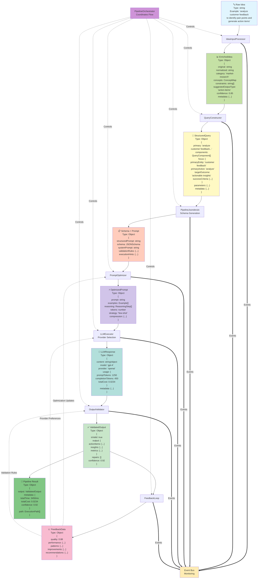

# jsonderulo Pipeline Architecture Diagram

## Pipeline Flow with Data Transformations



## Data Transformation Details

### 1. Raw Input → EnrichedIdea
**Component**: IdeaInputProcessor
```typescript
// Input
"analyze customer feedback to identify pain points and generate action items"

// Output
{
  original: "analyze customer feedback to identify pain points and generate action items",
  normalized: "analyze customer feedback identify pain points generate action items",
  category: "market-research",
  concepts: {
    entities: [
      { text: "analyze", type: "action", confidence: 0.9 },
      { text: "customer feedback", type: "object", confidence: 0.85 },
      { text: "pain points", type: "metric", confidence: 0.8 },
      { text: "action items", type: "object", confidence: 0.85 }
    ],
    relationships: [
      { from: "analyze", to: "customer feedback", type: "acts-on" },
      { from: "identify", to: "pain points", type: "acts-on" }
    ],
    keywords: ["customer", "feedback", "pain", "points", "action", "items"]
  },
  constraints: ["Must be data-driven", "Requires reliable sources"],
  suggestedOutputType: "action-items",
  confidence: 0.85,
  metadata: {
    wordCount: 12,
    complexity: "moderate",
    language: "en",
    timestamp: "2024-01-25T10:30:00Z"
  }
}
```

### 2. EnrichedIdea → StructuredQuery
**Component**: QueryConstructor
```typescript
// Transforms enriched idea into optimized query structure
{
  primary: "analyze customer feedback to identify pain points and achieve actionable insights",
  components: [
    {
      type: "objective",
      content: "To analyze customer feedback",
      priority: "required",
      rationale: "Primary action identified from idea analysis"
    },
    {
      type: "scope",
      content: "Focusing on: customer feedback, pain points, action items",
      priority: "required"
    },
    {
      type: "constraint",
      content: "Must be data-driven",
      priority: "required"
    },
    {
      type: "output",
      content: "Expected output format: action-items",
      priority: "required"
    }
  ],
  focus: {
    primaryEntity: "customer feedback",
    primaryAction: "analyze",
    targetOutcome: "generate actionable steps for analyzing customer feedback",
    successCriteria: [
      "Identify key pain points",
      "Prioritize by impact",
      "Generate actionable recommendations"
    ]
  },
  parameters: {
    depth: "standard",
    format: "structured",
    tone: "conversational",
    verbosity: "balanced"
  },
  metadata: {
    optimizationScore: 0.78,
    estimatedComplexity: 4.2,
    suggestedTokenBudget: 1500,
    confidenceLevel: 0.85
  }
}
```

### 3. StructuredQuery → Schema + Prompt
**Component**: PipelineJsonderulo
```typescript
// Generates JSON schema and prompt
{
  structuredPrompt: "Analyze the following customer feedback data and generate action items...",
  schema: {
    type: "object",
    properties: {
      actionItems: {
        type: "array",
        items: {
          type: "object",
          properties: {
            title: { type: "string" },
            description: { type: "string" },
            priority: { type: "string", enum: ["high", "medium", "low"] },
            category: { type: "string" },
            estimatedImpact: { type: "string" }
          },
          required: ["title", "description", "priority"]
        }
      },
      insights: {
        type: "array",
        items: {
          type: "object",
          properties: {
            finding: { type: "string" },
            evidence: { type: "array", items: { type: "string" } },
            recommendation: { type: "string" }
          }
        }
      },
      summary: { type: "string" }
    },
    required: ["actionItems", "insights", "summary"]
  },
  systemPrompt: "You are an expert analyst. Generate structured output following the schema.",
  validationRules: {
    requiredFields: ["actionItems", "insights", "summary"],
    minActionItems: 3,
    maxActionItems: 10
  },
  executionHints: {
    recommendedProvider: "openai",
    recommendedModel: "gpt-4",
    estimatedTokens: 1500,
    estimatedCost: 0.025,
    temperature: 0.7
  }
}
```

### 4. Schema + Prompt → OptimizedPrompt
**Component**: PromptOptimizer
```typescript
// Optimizes for specific model/provider
{
  prompt: "<<Optimized prompt with examples and reasoning>>",
  examples: [
    {
      input: "Customer says: 'Login process is confusing'",
      output: {
        actionItems: [{
          title: "Simplify login flow",
          description: "Reduce steps from 5 to 3",
          priority: "high"
        }]
      }
    }
  ],
  reasoning: [
    { step: 1, instruction: "First, categorize feedback by theme" },
    { step: 2, instruction: "Then, identify root causes" },
    { step: 3, instruction: "Finally, generate specific actions" }
  ],
  tokens: 1250,
  strategy: "few-shot",
  compression: {
    original: 1500,
    compressed: 1250,
    ratio: 0.83
  }
}
```

### 5. OptimizedPrompt → LLMResponse
**Component**: LLMExecutor
```typescript
// Executes with selected provider
{
  content: {
    actionItems: [
      {
        title: "Redesign login interface",
        description: "Implement single-page login with clear visual hierarchy",
        priority: "high",
        category: "UX",
        estimatedImpact: "Reduce support tickets by 30%"
      },
      // ... more items
    ],
    insights: [
      {
        finding: "45% of complaints relate to authentication",
        evidence: ["Login timeout issues", "Password reset confusion"],
        recommendation: "Implement SSO and improve password recovery flow"
      }
    ],
    summary: "Analysis reveals authentication as primary pain point..."
  },
  model: "gpt-4",
  provider: "openai",
  usage: {
    promptTokens: 1250,
    completionTokens: 450,
    totalCost: 0.0234
  },
  metadata: {
    latency: 2100,
    streamingEnabled: false,
    temperature: 0.7
  }
}
```

### 6. LLMResponse → ValidatedOutput
**Component**: OutputValidator
```typescript
// Validates and potentially repairs output
{
  isValid: true,
  output: {
    actionItems: [...], // Validated action items
    insights: [...],    // Validated insights
    summary: "..."      // Validated summary
  },
  validationReport: {
    schemaValid: true,
    semanticValid: true,
    businessRulesValid: true,
    warnings: [],
    suggestions: ["Consider adding timeline estimates"]
  },
  repairs: [], // No repairs needed
  confidence: 0.92
}
```

### 7. ValidatedOutput → FeedbackData
**Component**: FeedbackLoop
```typescript
// Collects performance metrics
{
  executionId: "pipeline-123",
  timestamp: "2024-01-25T10:31:45Z",
  quality: 0.88,
  performance: {
    totalTime: 3450,
    validationTime: 120,
    llmTime: 2100
  },
  patterns: [
    {
      type: "success-pattern",
      description: "Few-shot examples improved action item quality",
      frequency: 0.75
    }
  ],
  improvements: [
    {
      component: "PromptOptimizer",
      suggestion: "Add domain-specific examples",
      impact: 0.15
    }
  ],
  recommendations: {
    promptStrategy: "Increase examples for this category",
    providerSelection: "Continue with current provider",
    validationRules: "Add timeline validation"
  }
}
```

## Event Flow

Each component emits events throughout execution:

```typescript
// Example events emitted
{
  type: "processing-started",
  component: "IdeaInputProcessor",
  payload: { ideaLength: 72, timestamp: "..." }
}

{
  type: "schema-generated", 
  component: "PipelineJsonderulo",
  payload: { 
    schemaComplexity: "medium",
    fieldCount: 12,
    schemaSource: "template"
  }
}

{
  type: "validation-completed",
  component: "OutputValidator",
  payload: {
    valid: true,
    repairsNeeded: 0,
    validationTime: 120
  }
}
```

## Key Data Types

### ConceptMap
```typescript
interface ConceptMap {
  entities: Array<{
    text: string;
    type: 'action' | 'object' | 'attribute' | 'metric' | 'constraint';
    confidence: number;
  }>;
  relationships: Array<{
    from: string;
    to: string;
    type: string;
  }>;
  keywords: string[];
}
```

### ExecutionHints
```typescript
interface ExecutionHints {
  recommendedProvider: string;
  recommendedModel: string;
  estimatedTokens: number;
  estimatedCost: number;
  temperature: number;
  fallbackProviders: string[];
  timeout: number;
  retryStrategy: {
    maxRetries: number;
    backoffMs: number;
  };
}
```

### ValidationRules
```typescript
interface ValidationRules {
  requiredFields: string[];
  fieldValidation: Record<string, any>;
  customValidators: Array<{
    name: string;
    validatorId: string;
    parameters?: any;
  }>;
  semanticRules: Array<{
    field: string;
    rule: string;
    severity: 'error' | 'warning';
  }>;
  businessRules: BusinessRule[];
}
```